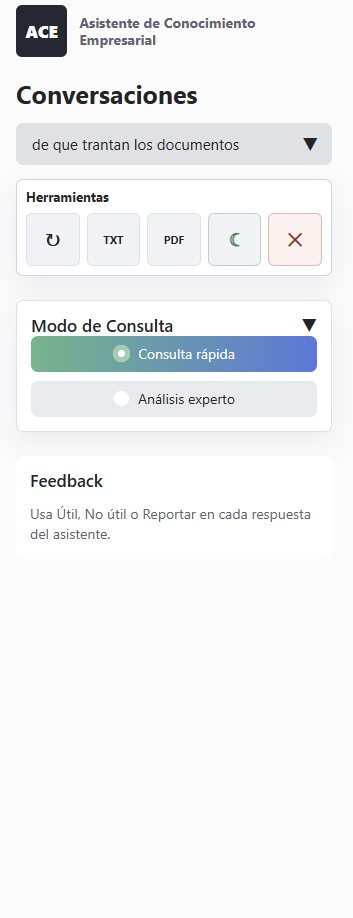
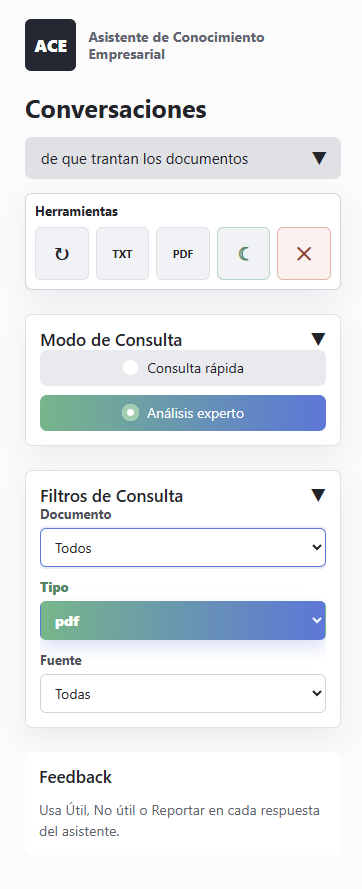
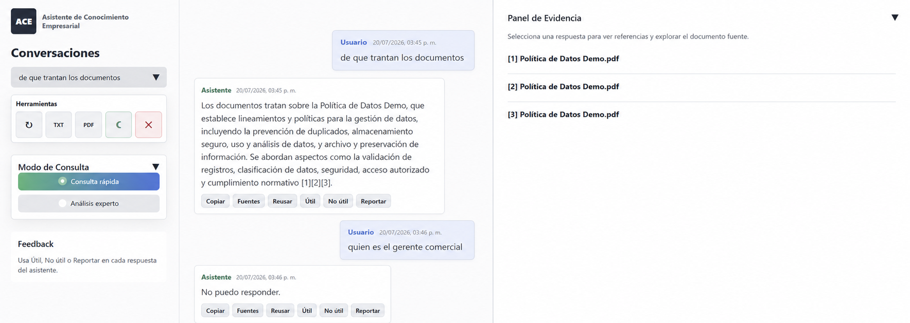
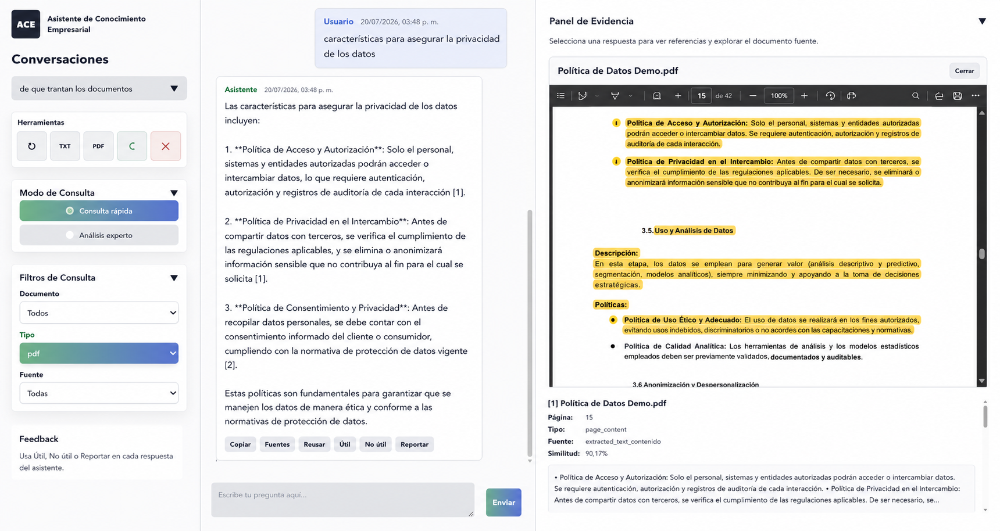
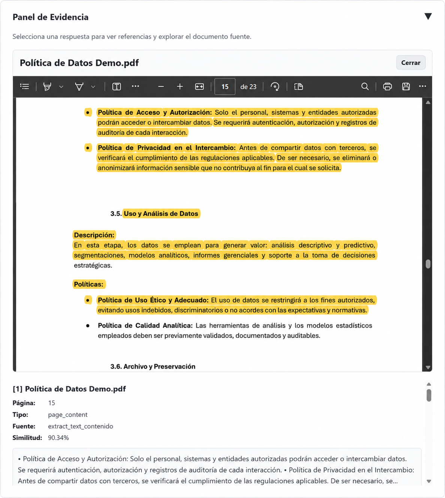
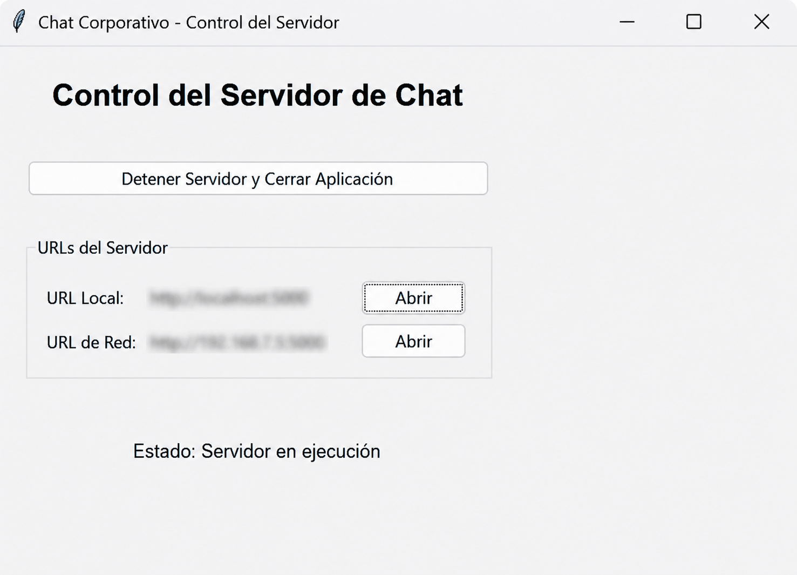

# Enterprise Document RAG Assistant

Public portfolio case study of a Retrieval-Augmented Generation (RAG) assistant for querying PDF and Excel documents with natural language.

> **Repository status:** this public version documents the architecture, interface and selected reusable components of a private working implementation. It is not yet a complete end-to-end public demo.

## What this project demonstrates

- Document ingestion for PDF and Excel.
- Optional OCR for scanned PDF pages.
- Token-aware chunking with metadata.
- OpenAI embeddings.
- Persistent local vector storage with ChromaDB.
- Hybrid retrieval combining semantic similarity and BM25.
- Grounded answers with numbered source references.
- Evidence inspection with document, page, extraction source and similarity metadata.
- Fast and expert consultation modes.
- Local Flask application with controlled access and server administration.

## Problem

Organizations often store valuable knowledge across PDF reports, scanned documents and spreadsheets. Finding a precise answer can require manually reviewing many files, pages and worksheets.

The solution converts those documents into a searchable knowledge base and allows users to ask questions in natural language while preserving traceability to the original sources.

## Architecture

```text
PDF / XLS / XLSX
        |
        v
Text extraction and optional OCR
        |
        v
Token-aware chunking and metadata enrichment
        |
        v
OpenAI embeddings
        |
        v
ChromaDB persistent vector store
        |
        v
Hybrid retrieval: semantic similarity + BM25
        |
        v
Prompt construction with retrieved context
        |
        v
Grounded answer with source references
        |
        v
Evidence panel and highlighted source document
```

See [`docs/architecture.md`](docs/architecture.md) for more detail.

## Application preview

All screenshots use sanitized or demonstration content. Names, internal URLs and confidential information were removed or replaced before publication.

### Controlled access

The assistant can optionally require a PIN before users access the document knowledge base.


### Fast query mode

Fast mode provides concise answers with citations, conversation controls, export options and feedback actions.



### Expert query filters

Expert mode enables retrieval filters by document, file type and extraction source.



### Grounded answers with citations

Answers include numbered references connected to the evidence retrieved from the indexed documents. The interface also demonstrates a safe fallback when available evidence is insufficient.



### Expert analysis

The expert workflow provides a more detailed answer and exposes retrieval evidence for additional transparency.



### Highlighted source evidence

Users can open the original PDF and inspect the exact passages used to support the response. The panel displays page, content type, extraction source and similarity score.



### Local server control

A desktop control panel manages the locally hosted application and shows its execution status without exposing private network information in this public repository.



## Main features

- PDF and Excel processing.
- OCR fallback for scanned PDF pages.
- Token-aware chunking with overlap.
- Metadata for document, page, sheet, section and extraction source.
- Local persistent vector index.
- Hybrid ranking using semantic and keyword signals.
- Flask web interface.
- Fast and expert query modes.
- Filters by document, type and extraction source.
- Source references in generated answers.
- Evidence panel with similarity scores.
- Highlighted passages in the original PDF.
- TXT and PDF export controls.
- User feedback actions.
- Optional PIN access.
- Local server administration interface.

## Technology stack

Python, Flask, OpenAI API, ChromaDB, PyMuPDF, Tesseract OCR, pandas, openpyxl, NumPy, tiktoken, HTML, CSS and JavaScript.

## Public repository structure

```text
assets/screenshots/       Sanitized application screenshots
docs/                     Architecture, case study and security notes
src/enterprise_rag/       Selected reusable public components
.env.example              Safe configuration example
requirements.txt          Current public dependency list
```

## Documentation

- [`Case study`](docs/case-study.md)
- [`Architecture`](docs/architecture.md)
- [`Technical decisions`](docs/technical-decisions.md)
- [`Execution example`](docs/execution-example.md)
- [`Security and privacy`](docs/security.md)
- [`Current limitations`](docs/limitations.md)
- [`Roadmap`](docs/roadmap.md)

## Selected public components

The repository currently includes selected, reconstructed components such as:

- Typed environment configuration.
- Token-aware chunking.
- Hybrid semantic and BM25 ranking.

The complete private application, confidential documents, generated embeddings and client-specific logic are intentionally excluded.

## Security and privacy

This repository does not publish private documents, generated embeddings, ChromaDB indexes, logs, API keys, internal URLs, client-specific rules or the commit history of the private implementation.

See [`docs/security.md`](docs/security.md).

## Portfolio context

This repository demonstrates how the project was designed and used while protecting confidential information. A small reproducible public demo is planned as a later phase.

## License

MIT License.
